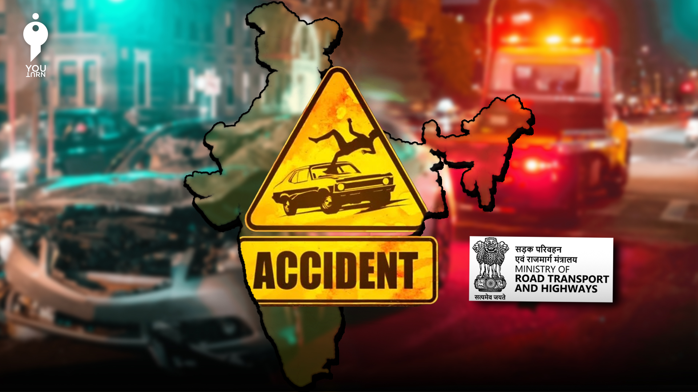

# 🚦 Traffic Death Analysis using SQL


This repository contains a comprehensive analysis of traffic accidents, focusing on various factors contributing to accident frequency and severity. The analysis is categorized into three levels: Basic, Intermediate, and Advanced, each addressing specific queries and insights drawn from the data.

## 📊 Project Overview


The goal of this project is to analyze traffic accident data to uncover trends, identify key factors associated with accident severity, and provide insights that could help in reducing traffic-related fatalities. The analysis is performed using SQL queries on a dataset that includes various attributes such as accident types, weather conditions, road conditions, and driver demographics.

## 📁 Data Sources


The dataset used for this analysis includes records of traffic accidents, detailing information such as the number of vehicles involved, fatalities, injuries, accident types, weather conditions, light conditions, road conditions, and more.

## 🛠️ Setup and Usage


To run the analysis on your local machine, follow these steps:

1. **Clone the Repository**:
   ```bash
   git clone https://github.com/VathareVinayak/Traffic-Death-Analysis-SQL.git


2.Ensure You Have a SQL Database Setup:

1. Import the provided dataset into your SQL database.
2. Adjust the SQL queries to match your database schema if needed.


## 🔍 Analysis Overview

### 🟢 Basic Tasks

- **Retrieve the total number of vehicles involved in accidents.**
- **Calculate the total number of fatalities in all accidents.**
- **Identify the least common accident type.**
- **Identify the least common light condition during accidents.**
- **List the top 5 least accident-prone locations.**

### 🟡 Intermediate Tasks

- **Determine the distribution of accidents by day of the week.**
- **Join tables to find the average number of injuries per accident.**
- **Group accidents by month and calculate the average number of accidents per month.**
- **Find the correlation between weather conditions and accident frequency.**
- **Identify the top 3 accident types with the highest number of injuries.**

### 🔴 Advanced Tasks

- **Calculate the percentage contribution of each light condition to the total number of accidents.**
- **Analyze trends in accident severity over different months.**
- **Determine the top 3 most frequent accident types for each day of the week.**
- **Analyze the relationship between road conditions and accident severity.**
- **Evaluate the impact of time of day on the severity of accidents.**
- **Assess the influence of driver demographics on accident frequency and severity.**


## 📝 Conclusion


This analysis provides a detailed exploration of traffic accidents, highlighting critical areas such as accident severity, frequency, and contributing factors. By understanding these patterns, stakeholders can implement targeted strategies to improve road safety and reduce the occurrence of fatal accidents.

## 🤝 Contributing


Contributions are welcome! If you have suggestions or improvements, feel free to submit a pull request or open an issue.
